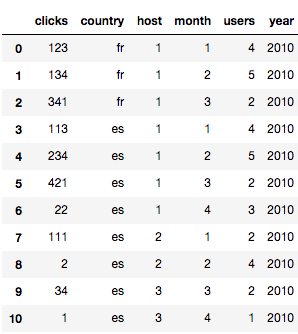
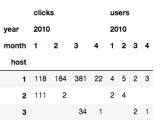
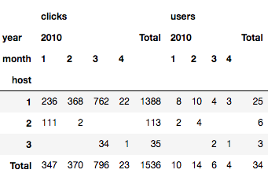
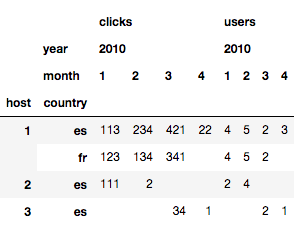
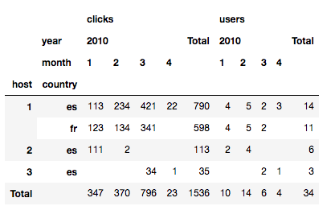
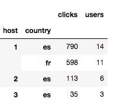
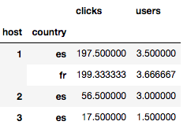
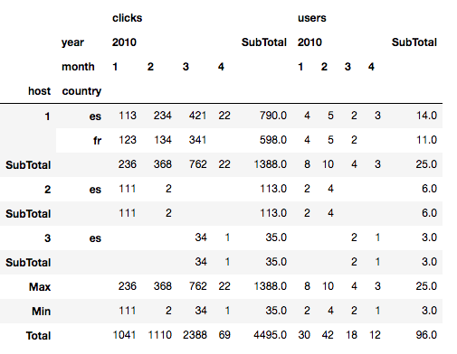

## Data Analysis with Python. Pivot tables with Pandas

One of the first post in my blog was about Pivot tables. I'd created a library to pivot tables in my PHP scripts. The library is not very beautiful (it throws a lot of warnings), but it works. These days I'm playing with Python Data Analysis and I'm using Pandas. The purpose of this post is something that I like a lot: Learn by doing. So I want to do the same operations that I did eight years ago in the post but now with Pandas. Let's start.

I'll start with the same datasource that I used almost ten years ago. One simple recordset with cliks and number of users

I create a dataframe with this data
```python
import numpy as np
import pandas as pd

data = pd.DataFrame([
    {'host': 1, 'country': 'fr', 'year': 2010, 'month': 1, 'clicks': 123, 'users': 4},
    {'host': 1, 'country': 'fr', 'year': 2010, 'month': 2, 'clicks': 134, 'users': 5},
    {'host': 1, 'country': 'fr', 'year': 2010, 'month': 3, 'clicks': 341, 'users': 2},
    {'host': 1, 'country': 'es', 'year': 2010, 'month': 1, 'clicks': 113, 'users': 4},
    {'host': 1, 'country': 'es', 'year': 2010, 'month': 2, 'clicks': 234, 'users': 5},
    {'host': 1, 'country': 'es', 'year': 2010, 'month': 3, 'clicks': 421, 'users': 2},
    {'host': 1, 'country': 'es', 'year': 2010, 'month': 4, 'clicks': 22, 'users': 3},
    {'host': 2, 'country': 'es', 'year': 2010, 'month': 1, 'clicks': 111, 'users': 2},
    {'host': 2, 'country': 'es', 'year': 2010, 'month': 2, 'clicks': 2, 'users': 4},
    {'host': 3, 'country': 'es', 'year': 2010, 'month': 3, 'clicks': 34, 'users': 2},
    {'host': 3, 'country': 'es', 'year': 2010, 'month': 4, 'clicks': 1, 'users': 1}
])
```



Now we want to do a simple pivot operation. We want to pivot on host

```python
pd.pivot_table(data,
   index=['host'], 
   values=['users', 'clicks'], 
   columns=['year', 'month'],
   fill_value=''
  )
```



We can add totals

```python
pd.pivot_table(data,
               index=['host'], 
               values=['users', 'clicks'], 
               columns=['year', 'month'],
               fill_value='',
               aggfunc=np.sum, 
               margins=True, 
               margins_name='Total'
              )
```



We can also pivot on more than one column. For example host and country

```python
pd.pivot_table(data,
               index=['host', 'country'], 
               values=['users', 'clicks'], 
               columns=['year', 'month'],
               fill_value=''
              )
```



and also with totals

```python
pd.pivot_table(data,
               index=['host', 'country'], 
               values=['users', 'clicks'], 
               columns=['year', 'month'],
               aggfunc=np.sum, 
               fill_value='',
               margins=True, 
               margins_name='Total'
              )
```



We can group by dataframe and calculate subtotals

```python
data.groupby(['host', 'country'])[('clicks', 'users')].sum()
```


```python
data.groupby(['host', 'country'])[('clicks', 'users')].mean()
```


And finally we can mix totals and subtotals.

```python
out = data.groupby('host').apply(lambda sub: sub.pivot_table(
    index=['host', 'country'], 
    values=['users', 'clicks'], 
    columns=['year', 'month'],
    aggfunc=np.sum, 
    margins=True,
    margins_name='SubTotal',
))

out.loc[('', 'Max', '')] = out.max()
out.loc[('', 'Min', '')] = out.min()
out.loc[('', 'Total', '')] = out.sum()

out.index = out.index.droplevel(0)

out.fillna('', inplace=True)
out
```



And that's all. A lot of to learn yet about data analysis, but Pandas will be definitely a good friend of mine.